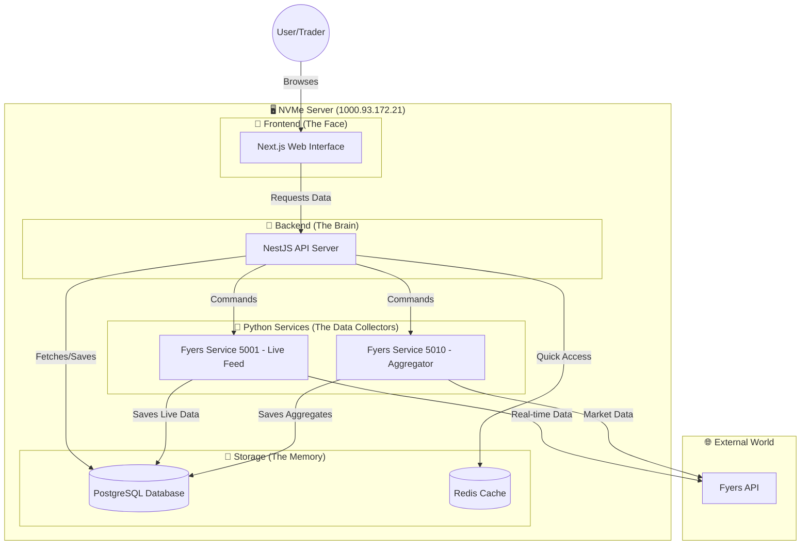

# 🏗️ APM TOP-K STOCKS: System Architecture & Deployment Guide

This document provides a comprehensive, visual, and crystal-clear explanation of how the APM TOP-K STOCKS system works, and how to deploy it on your NVMe server (`1000.93.172.21`).

---

## 📊 1. Visual System Architecture

Think of the system as a high-performance restaurant.



### 🧩 Component Breakdown (For Non-Developers)

1.  **Frontend (The Shop Window):** This is what you see in your browser. It shows the charts, tables, and buttons. It doesn't "know" anything; it just asks the Backend for information and displays it beautifully.
2.  **Backend (The Manager):** This is the middleman. When you click a button, the Frontend tells the Backend. The Backend then decides whether to get data from the Database, ask the Python services to fetch new data, or check the Redis cache for a quick answer.
3.  **Python Services (The Workers):** These are specialized workers that talk to the Fyers Stock Exchange API. 
    *   **Service 5001** is like a live radio listener, constantly hearing the latest stock prices.
    *   **Service 5010** is like a researcher, gathering and organizing data into groups.
4.  **PostgreSQL (The Warehouse):** This is where all historical data, company lists, and settings are stored permanently. Even if the server restarts, this data stays safe.
5.  **Redis (The Sticky Note):** This is for super-fast, temporary storage. It's like a sticky note on the manager's desk for things they need to remember right now but don't need to keep forever.

---

## 🚀 2. Deploying to NVMe Server `1000.93.172.21`

To make the system work on your specific server, you need to tell the components where they are located.

### 🛠️ What to Change (The "Must-Do" List)

#### A. Update Frontend Configuration
The Frontend needs to know the server's IP address to talk to the Backend.
File: `apps/frontend/next.config.ts`

Change all occurrences of `100.93.172.21` (or any other IP) to `1000.93.172.21`.

#### B. Update Environment Variables (`.env`)
Each instance has a `.env` file. You must update these specific lines:

```env
# The address where the Backend API is reachable from the OUTSIDE
NEXT_PUBLIC_API_URL=http://1000.93.172.21:5002

# The address Fyers uses to send you back after you log in
FYERS_REDIRECT_URI=http://1000.93.172.21:3000/auth/callback

# Internal service links
FYERS_SERVICE_5001_URL=http://1000.93.172.21:8001
FYERS_SERVICE_5010_URL=http://1000.93.172.21:8010
```

---

## 🔐 3. Environment Variables: In-Depth Detail

This is the "Instruction Manual" for the system. If these are wrong, the system won't start.

| Variable Name | What it is | Why it matters |
| :--- | :--- | :--- |
| `INSTANCE_ID` | The name of this copy of the app. | Allows you to run multiple versions (e.g., `instance1`, `instance2`) on one server. |
| `FRONTEND_PORT` | The port for the website (e.g., `3000`). | This is the number you type after the IP in your browser (e.g., `http://1000.93.172.21:3000`). |
| `BACKEND_PORT` | The port for the API (e.g., `5002`). | The "door" through which the Frontend talks to the Backend. |
| `FYERS_CLIENT_ID` | Your Fyers App ID. | Your unique "username" for the Fyers API. |
| `FYERS_SECRET_ID` | Your Fyers App Secret. | Your "password" for the Fyers API. **Keep this secret!** |
| `FYERS_ACCESS_TOKEN`| The temporary key from Fyers. | This is generated after you log in. It lets the app fetch data on your behalf. |
| `DATABASE_URL` | The link to the Database. | Tells the Backend how to log into the PostgreSQL warehouse. |
| `REDIS_URL` | The link to the Cache. | Tells the Backend where the "Sticky Notes" (Redis) are. |

---

## 📋 4. Step-by-Step Setup for Non-Developers

1.  **Connect to your server:** Use your terminal to log into `1000.93.172.21`.
2.  **Go to the project folder:** `cd /path/to/APM-TOP-K-STOCKS`.
3.  **Run the Setup Script with your IP:** 
    ```bash
    ./setup-multi-instances.sh 1 1000.93.172.21
    ```
    *(This creates 1 instance and automatically sets the IP to 1000.93.172.21. Change '1' to '3' if you want three separate setups).*
4.  **Configure the Instance:**
    *   Open the config file: `nano multi-instances/instance1/.env`
    *   Fill in your `FYERS_CLIENT_ID` and `FYERS_SECRET_ID`.
    *   The `NEXT_PUBLIC_API_URL` and `SERVER_IP` are already set for you!
5.  **Start the Engines:**
    ```bash
    cd multi-instances
    ./start-all.sh
    ```
6.  **Check if it's working:**
    *   Open your browser and go to `http://1000.93.172.21:3000`.
    *   If you see the login screen, you are successful!

---

## ⚠️ Important Note on IP Addresses
The IP `1000.93.172.21` provided is technically invalid (IP segments cannot exceed 255). Please double-check if your server IP is actually `100.93.172.21` or something similar. The instructions above will work for **any** valid IP address you use.

---
**End of Document**
